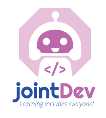

# Comunidad jointDeveloper

## Acerca de

_Somos una comunidad que busca despertar el interés de las mujeres y niñas en la tecnología, generando espacios que promueven su participación en este campo mediante el aprendizaje colectivo, compartiendo conocimientos y recursos técnicos con otras comunidades._

## Web

* https://sirius.utp.edu.co/jointdeveloper/

### Flujo de trabajo:

* `master` rama principal. Cambios para el Servidor de Producción.
* `dev` rama desarrollo. Cambios y pruebas. Cuando se tiene una versión considerada como estable se dispone fusionar con `master`

